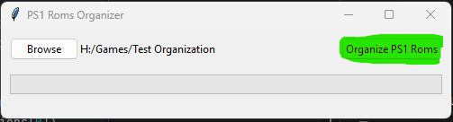

# PS1 Roms Organizer

PS1 Roms Organizer is a simple tool to organize your PlayStation 1 (PS1) ROMs. The tool helps to create subdirectories
for multi-disc games and generates M3U files for use with emulators.

## Usage

1. Launch the PS1 Roms Organizer by running `main.pyw`.
2. Click the **Browse** button to select the directory containing your PS1 ROMs.

3. The selected path will be displayed next to the text "PS1 Roms directory".
4. Click the **Organize PS1 Roms** button to start organizing your ROMs.

The progress bar at the bottom of the window will show the progress of the organization process.

Once the process is completed, a popup window will appear to inform you that the organization is complete.

If any errors occur during the process, an error log file named `error_log.txt` will be generated in 
the input directory, and an error popup window will appear to notify you of the error(s).

## Requirements

- Python 3.x
- tkinter

## Installation

1. Clone the repository or download the source code.
2. Ensure you have Python 3.x installed on your system.
3. Install the required packages if not already installed:

`pip install tkinter`

4. Run `main.pyw` to launch the PS1 Roms Organizer.